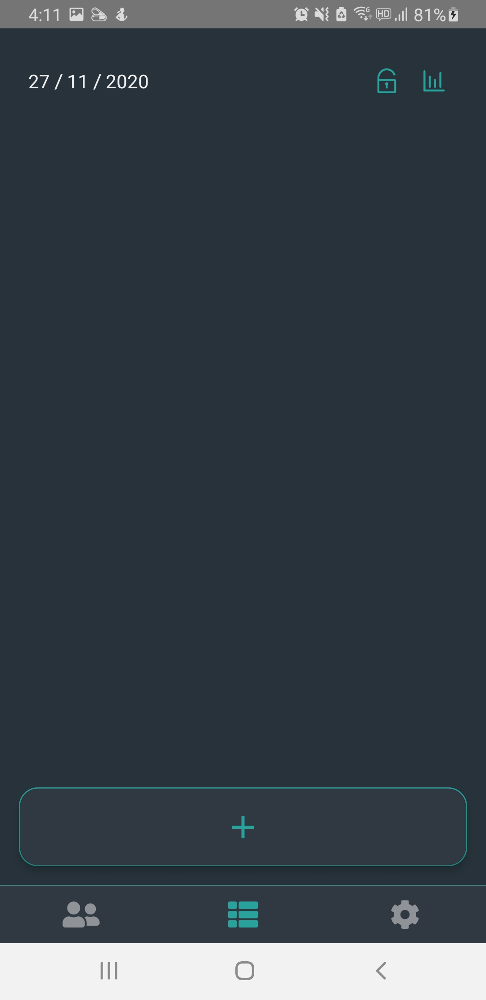
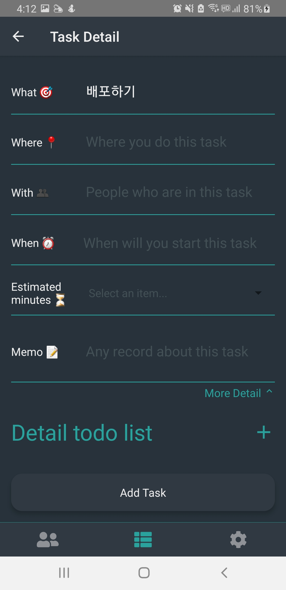
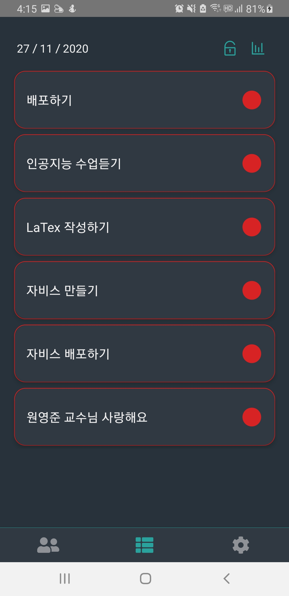
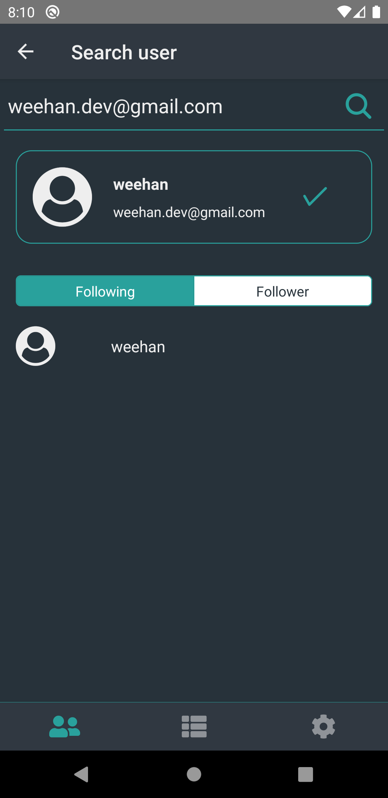

# STMT React Native 

[한국어](./README.md)

## Introduction

STMT is cross platform application which is made of [React Native](https://reactnative.dev/)

### Login


### Main, Set task





### Dashboard


### Social



## Skill

- [x] Typescript
- [x] Redux
- [x] Redux Saga
- [x] React Navigation
- [x] Styled Components
- [ ] Fastlane
- [ ] Sentry

## Install Guide ⚙️

### AppStore & Google Playstore 📱

Not deployed yet...

### Development

> ❗️ [React Native Development environemnt](https://reactnative.dev/docs/environment-setup) is required

1. Clone project

```
git clone https://github.com/6-things-must-to-do/app.git
```

1. The Google Firebase project is required for the authentication process. Both Android and iOS package names must be com.stmt. After you create your project, you must download Google-services.json and GoogleService-Info.plist.

- `google-services.json` must be in `android/app/` directory
- `GoogleService-Info.plist`must be in `ios/STMT/` directory

1. Install packages.

```
cd app && yarn

# iOS
cs ios && pod install
```

4. Build project.
```
yarn android

or

yarn ios
```

## Author
- [Changhoi Kim](https://github.com/changhoi)

## Contributors
- [eunchai512](https://github.com/eunchai512)
- [Jungeun Kim](https://github.com/JungeunK-9999)